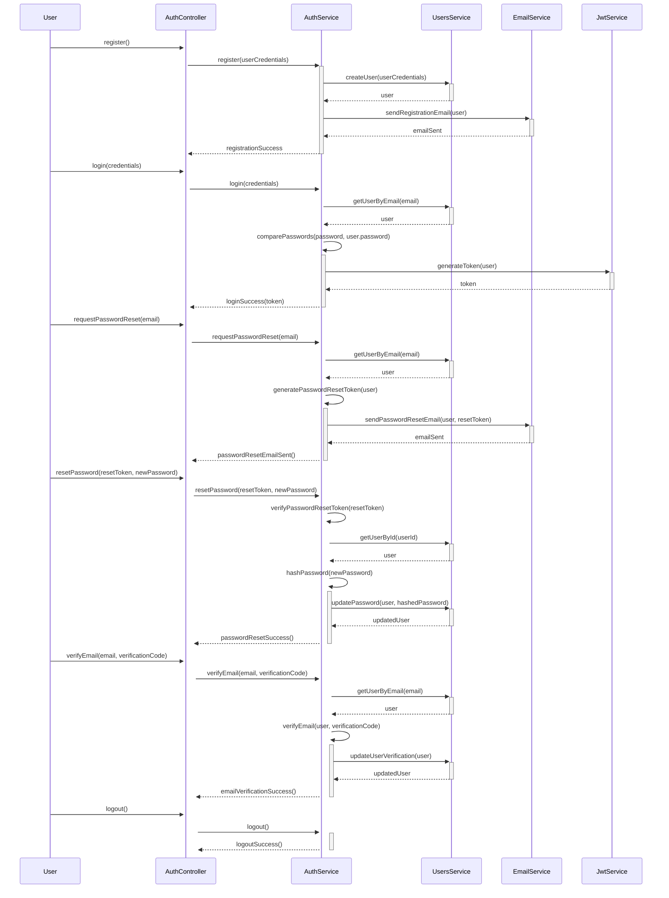
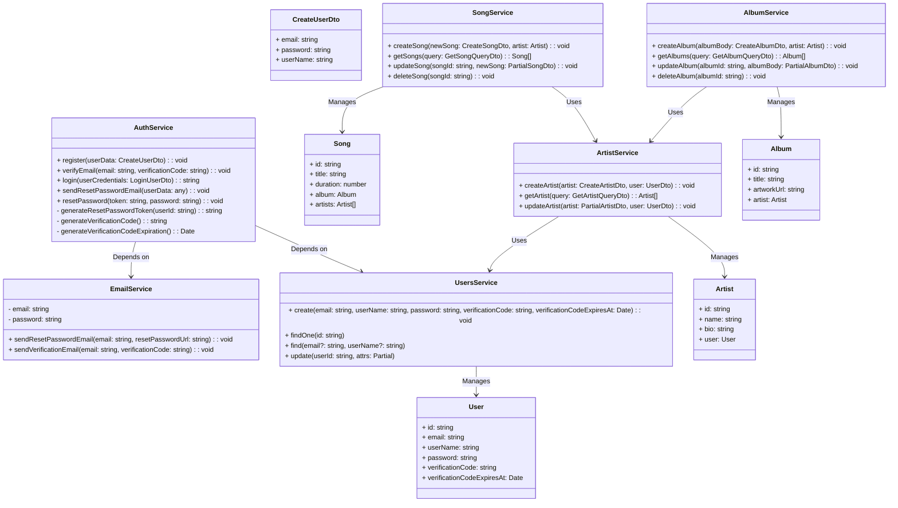

<a name="readme-top"></a>


<br>
<br>

---
### 📑 Table of Contents
- [📘 Introduction](#introduction)
- [💻 Getting Started](#getting-started)
  - [Prerequisites ❗](#prerequisites)
  - [Environment Variables :key:](#environment-variables)
  - [Setup ⬇️](#setup)
  - [Install :heavy_check_mark: ](#install)
  - [Usage 🤿 🏃‍♂️](#usage)
- [🔍 APIs Reference](#api-reference)
- [🏗️🔨 Database ERD](#erd)
- [🔄 Authentication Sequence Diagrams](#sequence-diagram)
- [📐 UML Diagram](#uml-diagram)
- [👥 Author](#author)
- [🤝 Contributing](#contribution)
- [👀 Kanban Board](#kanban-board) 
- [⭐️ Show Your Support](#support)
- [🔭 Up Next](#up-next)
- [💎 Lessons Learned](#lessons-learned)
- [🙏 Acknowledgements](#acknowledgements)
- [📜 License ](#license)


## 📘 Introduction <a name="introduction"></a>
<p align="center">
🎻 Conduct your music empire! 🎧 Music Store is your one-stop API to manage artists, albums, and songs. ✨ Search, filter, integrate - it's your musical symphony. 🎶
</p>

<p align="center">
  Welcome to **Music Store** API, a powerful and efficient REST API built with NestJS that serves as your ultimate solution for managing your music empire. With **Music Store** API, you can easily organize and control your artists, albums, and songs, creating a seamless and immersive musical experience for your users.
</p>

<p align="center">
  **Music Store** API prioritizes the security and reliability of your music assets. The API implements robust authentication mechanisms, ensuring secure access to your music collection. With built-in security features, you can protect sensitive data and provide a safe environment for your users' musical journey.
</p>

## 💻 Getting Started <a name="getting-started"></a>
To get a local copy up and running, follow these steps.

### Prerequisites ❗<a name="prerequisites"></a>

In order to run this project you need:
<p>
 
<a href="https://skillicons.dev">
        
    </a>
    <a href="https://www.npmjs.com/"></a>

 </p>

### Environment Variables :key: <a name="environment-variables"></a>
- `DATABASE_HOST`:  the mysql host (e.g. localhost)
- `DATABASE_PORT`: the port on which mysql are working on (e.g. 3306)
- `DATABASE_USERNAME`: your mysql username (e.g. mysql)
- `DATABASE_PASSWORD`: your mysql password (e.g. root)
- `DATABASE_NAME`: the database name on which the project will use (e.g. MusicStore)
- `JWT_SECRET`: the json web token signature to create or validate token (e.g. jwtsecret)
- `COOKIE_SESSION_SECRET`: your cookie session secret (e.g sessionsecret)

### Setup ⬇️ <a name="setup"></a>
1. Clone the repository:
```shell
   git clone https://github.com/ahmedeid6842/music-store
```
2. Change to the project directory:
```shell
cd ./music-store
```

### Install :heavy_check_mark: <a name="install"></a>
Install the project dependencies using NPM:

```shell
npm install
```

### Usage 🤿 🏃‍♂️ <a name="usage"></a>

To start the application in development mode, run the following command:

```shell
npm run start:dev
```

The application will be accessible at http://localhost:3000.

- Alright, it's showtime! 🔥 Hit `http://localhost:3000` and BOOM! 💥  You should see the docs page and the **Music Store** APIs working flawlessly. ✨🧙‍♂️

<p align="right">(<a href="#readme-top">back to top</a>)</p>

## [API reference](https://documenter.getpostman.com/view/10444163/2s9YeN18cS#26b3aaa9-f8c1-40bf-b570-2922aebb44e9)

This section provides detailed documentation and examples for the API endpoints used in the **Music Store** backend project.
You can Hit this [Link](https://documenter.getpostman.com/view/10444163/2s9YeN18cS#26b3aaa9-f8c1-40bf-b570-2922aebb44e9) to view the documentation.


## 🏗️🔨 [Database ERD](https://drawsql.app/teams/microverse-114/diagrams/music-store) <a name="erd"></a>


<p align="right">(<a href="#readme-top">back to top</a>)</p>

## 🔄 Authentication Sequence Diagrams <a name="sequence-diagram"></a>

<div align="center"> <h3> Auth Module </h3> </div>



<p align="right">(<a href="#readme-top">back to top</a>)</p>

## 📐 UML Diagram <a name="uml-diagram"></a>



<p align="right">(<a href="#readme-top">back to top</a>)</p>

## 👤 Author <a name="author"></a>
**Ahmed Eid 🙋‍♂️**
- Github: [@ahmedeid6842](https://github.com/ahmedeid6842/)
- LinkedIn : [Ahmed Eid](https://www.linkedin.com/in/ameid/)
- Twitter: [@ahmedeid2684](https://twitter.com/ahmedeid2684)

<p align="right">(<a href="#readme-top">back to top</a>)</p>

## 🤝 Contributing <a name="contribution"></a>

We're always looking to improve this project! 🔍 If you notice any issues or have ideas for new features, please don't hesitate to submit a [pull request](https://github.com/ahmedeid6842/music-store/pulls) 🙌 or create a [new issue](https://github.com/ahmedeid6842/music-store/issues/new) 💡. Your contribution will help make this project even better! ❤️ 💪

## 👀 Kanban Board <a name="kanban-board"></a>
You can check my kanban board from [Here](https://github.com/users/ahmedeid6842/projects/4) to see how I split this project into tasks and mange them.


## ⭐️ Show your support <a name="support"></a>

If you find this project helpful, I would greatly appreciate it if you could leave a star! 🌟 💟 

<p align="right">(<a href="#readme-top">back to top</a>)</p>

## 🔭 Up next <a name="up-next"></a>

- [ ] Implement Search engine for different songs searches 
- [ ] Enhance the DataBase queries time by using redis LRU caching
- [ ] Move from monolithic to microservices architecture.
- [ ] Apply Background jobs and task scheduling Use a job queue system like Bull or Agenda to handle time-consuming tasks.
- [ ] Support user media like image and upload songs.
- [ ] Deploy the REST API.
## 💎 Lessons Learned <a name="lessons-learned"></a> 

1. Secure user access with effective authentication and authorization.
2. Use a well-structured architecture, such as Nest.js, for code organization, scalability, and maintainability.
3. Take advantage of different NestJS components and decorators.
4. Manging the Many to Many relations
5. There is always something new to learn.

## 🙏 Acknowledgments <a name="acknowledgements"></a>

I am deeply grateful to Alexapps for entrusting me with this project. The opportunity to implement this innovative concept has been an invaluable learning experience.

## 📜 License <a name="license"></a>

This project is licensed under the MIT License - you can click here to have more details [MIT](./LICENSE) licensed.

<p align="right">(<a href="#readme-top">back to top</a>)</p>

<div align="center">
  
</div>
